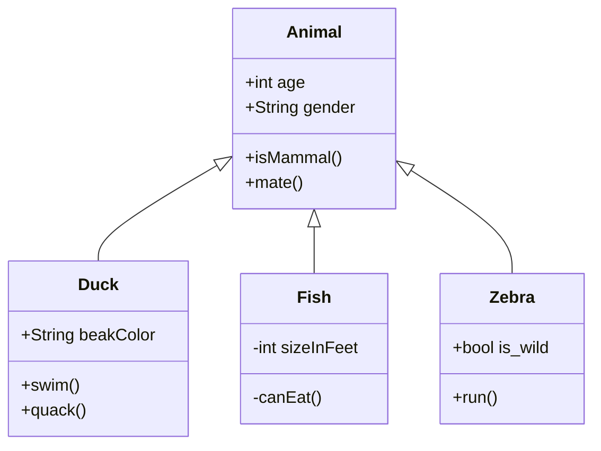

- [[Semester-2/Programmiertechnik/]]
	- [[Java Stream Collection]]
	- [[Semester-2/Programmiertechnik/Probeklausuren]]
	- [[Semester 2/Programmiertechnik/Klausurvorbereitung|Klausurvorbereitung]]
- [[Semester-2/Analysis/]]
	- [[Semester 2/Analysis/Klausurvorbereitung|Klausurvorbereitung]]

