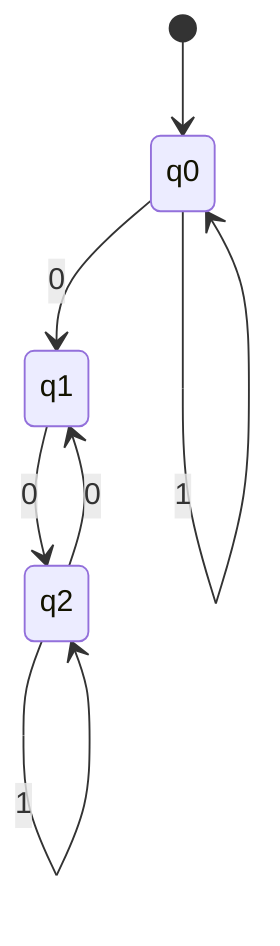

> [!Info]
> Die **Potenzmengenkonstruktion** ist ein Algorithmus, um einen **nichtdeterministischen endlichen Automaten (NEA)** in einen **deterministischen endlichen Automaten (DEA)** zu überführen. Sie stellt sicher, dass jeder nichtdeterministische Automat durch einen äquivalenten deterministischen Automaten simuliert werden kann.

---

## **Schritt-für-Schritt-Anleitung**

### **1. Gegebenen NEA definieren**
Ein NEA wird als **$M = (S, \Sigma, \delta, s_0, F)$** gegeben mit:
- **$S$**: Zustandsmenge
- **$\Sigma$**: Eingabealphabet
- **$\delta$**: Übergangsfunktion **$\delta: S \times \Sigma \to P(S)$**  
  → Gibt eine **Menge von Folgezuständen** zurück.
- **$s_0$**: Startzustand
- **$F$**: Menge der Endzustände

Beispiel-NEA:

| Zustand | Eingabe `0` | Eingabe `1` |
|---------|------------|------------|
| **q0**  | {q0, q1}  | {q0}       |
| **q1**  | {q2}      | {}         |
| **q2**  | {q1}      | {q2}       |

---

### **2. Startzustand des DEA definieren**
- Der neue Startzustand des DEA ist die **Potenzmenge** der NEA-Startzustände, d.h. **{q0}**.

---

### **3. Übergänge für alle Zustandsmengen berechnen**
- Jeder Zustand im DEA entspricht einer **Menge von NEA-Zuständen**.
- Für jede **Menge von Zuständen** und jedes **Eingabesymbol** werden die erreichbaren NEA-Zustände bestimmt.

#### Beispiel: Übergangskonstruktion

| DEA-Zustand | Eingabe `0` | Eingabe `1` |
|-------------|------------|------------|
| {q0}        | {q0, q1}   | {q0}       |
| {q0, q1}    | {q0, q1, q2} | {q0}    |
| {q2}        | {q1}       | {q2}       |

---

### **4. Endzustände bestimmen**
- Ein DEA-Zustand ist ein Endzustand, wenn **mindestens ein NEA-Endzustand** darin enthalten ist.

In unserem Beispiel:
- Falls **q2** ein Endzustand im NEA war, dann sind alle DEA-Zustände, die **q2 enthalten**, Endzustände.

Hier ist der ursprüngliche NEA:



Nun der resultierende DEA:

```mermaid
stateDiagram
    [*] --> "q0"
    "q0" --> "q0, q1" : 0
    "q0, q1" --> "q0, q1, q2" : 0
    "q0, q1, q2" --> "q0, q1, q2" : 0
    "q0, q1, q2" --> "q0" : 1
    "q0, q1" --> "q0" : 1
    "q0" --> "q0" : 1
    "q2" --> "q1" : 0
    "q2" --> "q2" : 1
```

---

## **Zusammenfassung**
- **Der NEA kann in einen DEA umgewandelt werden**, indem:
  1. Alle Zustandsmengen als neue DEA-Zustände definiert werden.
  2. Die Übergangsfunktion auf alle Zustandsmengen angewendet wird.
  3. Der Startzustand die Potenzmenge der NEA-Startzustände ist.
  4. Endzustände alle Zustände sind, die einen ursprünglichen NEA-Endzustand enthalten.

Die Potenzmengenkonstruktion stellt sicher, dass **jeder NEA durch einen äquivalenten DEA simuliert werden kann**. Allerdings kann die Anzahl der Zustände **exponentiell** ansteigen.
